# ESTUD-IA

Sistema Inteligente de Apoyo Pedagógico y Gestión del Aprendizaje para Instituciones Educativas

**ESTUD-IA** es una plataforma web de acompañamiento pedagógico que busca apoyar a los estudiantes dentro y fuera del aula mediante contenidos educativos, ejercicios interactivos, seguimiento del progreso y un **Tutor de Inteligencia Artificial**.

La propuesta está orientada principalmente a estudiantes que presentan dificultades de aprendizaje en áreas como **Matemática y Comprensión Lectora**, brindándoles la posibilidad de aprender y practicar a su propio ritmo.

**Curso Integrador II: Software** — Universidad Tecnológica del Perú

[Estud-IA](https://estud-ia.netlify.app/ )

---

## Tabla de contenido

- [ESTUD-IA](#estud-ia)
  - [Tabla de contenido](#tabla-de-contenido)
- [1. Sobre el proyecto](#1-sobre-el-proyecto)
  - [Problema identificado](#problema-identificado)
  - [Propuesta de solución](#propuesta-de-solución)
  - [Objetivo](#objetivo)
  - [Características principales](#características-principales)
    - [Para estudiantes](#para-estudiantes)
    - [Para docentes](#para-docentes)
    - [Para administradores](#para-administradores)
- [2. Usuarios del sistema](#2-usuarios-del-sistema)
- [3. Experiencia y diseño de interfaces](#3-experiencia-y-diseño-de-interfaces)
  - [Google Stitch: exploración inicial](#google-stitch-exploración-inicial)
    - [Proyecto en Google Stitch](#proyecto-en-google-stitch)
  - [Figma: prototipo de la aplicación](#figma-prototipo-de-la-aplicación)
    - [Prototipo](#prototipo)
  - [Interfaces principales](#interfaces-principales)
    - [Capturas de las interfaces](#capturas-de-las-interfaces)
- [4. Metodología Scrum](#4-metodología-scrum)
  - [Equipo Scrum](#equipo-scrum)
  - [Responsabilidades](#responsabilidades)
    - [Product Owner](#product-owner)
    - [Scrum Master](#scrum-master)
    - [Developers](#developers)
  - [Product Goal](#product-goal)
  - [Sprints](#sprints)
  - [Primer Sprint](#primer-sprint)
    - [Rol Estudiante](#rol-estudiante)
    - [Rol Administrador](#rol-administrador)
  - [Sprint Goal](#sprint-goal)
    - [Sprint Goal del Primer Sprint](#sprint-goal-del-primer-sprint)
  - [Sprint Backlog](#sprint-backlog)
  - [Definition of Done](#definition-of-done)
  - [5. Product Backlog](#5-product-backlog)
    - [Resumen del Product Backlog](#resumen-del-product-backlog)
    - [Épicas](#épicas)
    - [Product Backlog completo](#product-backlog-completo)
  - [6. Tecnologías y herramientas](#6-tecnologías-y-herramientas)
    - [Front-End](#front-end)
    - [Back-End](#back-end)
    - [Base de datos](#base-de-datos)
    - [Inteligencia Artificial](#inteligencia-artificial)
    - [Herramientas de desarrollo](#herramientas-de-desarrollo)
  - [7. Arquitectura](#7-arquitectura)
    - [Diagrama de arquitectura](#diagrama-de-arquitectura)
    - [Componentes principales](#componentes-principales)
      - [Front-End](#front-end-1)
      - [Back-End](#back-end-1)
      - [Base de datos](#base-de-datos-1)
      - [Inteligencia Artificial](#inteligencia-artificial-1)
  - [8. Estructura del repositorio](#8-estructura-del-repositorio)
  - [9. Control de versiones y GitFlow](#9-control-de-versiones-y-gitflow)
    - [Flujo de trabajo](#flujo-de-trabajo)
    - [GitFlow del proyecto](#gitflow-del-proyecto)
    - [Convención de ramas](#convención-de-ramas)
    - [Pull Requests](#pull-requests)
  - [10. Cómo ejecutar el proyecto](#10-cómo-ejecutar-el-proyecto)
    - [Requisitos previos](#requisitos-previos)
    - [1. Clonar el repositorio](#1-clonar-el-repositorio)
    - [2. Configurar el Back-End](#2-configurar-el-back-end)
      - [Configurar la base de datos](#configurar-la-base-de-datos)
    - [3. Configurar el Front-End](#3-configurar-el-front-end)
    - [4. Configurar el Tutor IA](#4-configurar-el-tutor-ia)
  - [Equipo](#equipo)

---

# 1. Sobre el proyecto

ESTUD-IA nace como una propuesta para brindar **acompañamiento académico personalizado** a estudiantes que necesitan reforzar sus conocimientos dentro y/o fuera del horario habitual de clases.

La aplicación combina contenidos educativos, ejercicios interactivos, seguimiento del progreso y un Tutor IA que puede responder dudas y proporcionar orientación durante el aprendizaje.

El proyecto considera también las diferencias de acceso tecnológico existentes entre contextos urbanos y rurales. Por ello, se busca que la plataforma sea **responsive, ligera, sencilla de utilizar y adaptable a diferentes dispositivos**.

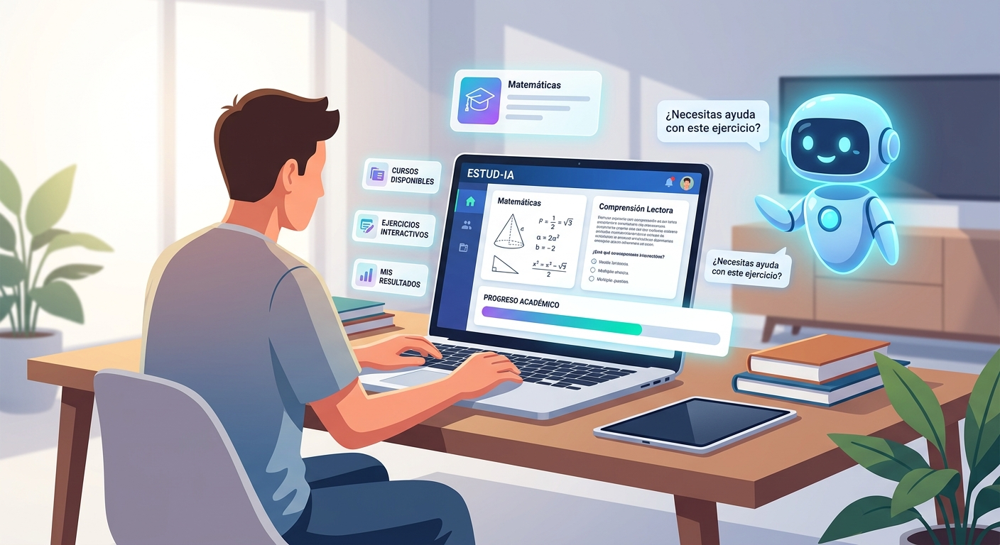

## Problema identificado

En un aula, un docente debe atender a varios estudiantes al mismo tiempo. Cuando un estudiante tiene dificultades para comprender un tema o resolver un ejercicio, no siempre puede recibir ayuda inmediatamente.

Esto puede provocar que las dudas se acumulen, aparezcan vacíos de aprendizaje y el estudiante pierda motivación para continuar.

Por otro lado, el docente puede tener dificultades para identificar rápidamente qué temas están generando mayores problemas en sus estudiantes.

En este contexto, se identifica la necesidad de contar con una herramienta que permita al estudiante **continuar aprendiendo de manera autónoma**, recibir apoyo cuando tenga dudas y visualizar su rendimiento.

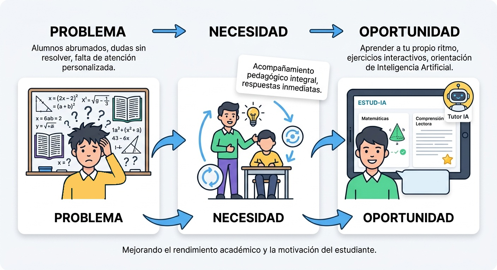

## Propuesta de solución

ESTUD-IA funciona como un **acompañante pedagógico integral** dentro y fuera del aula.

La propuesta se centra en cuatro elementos:

- **Contenidos educativos:** organizados por cursos y materias.
- **Ejercicios interactivos:** permiten practicar y comprobar los conocimientos adquiridos.
- **Tutor IA:** permite realizar preguntas y recibir orientación durante el aprendizaje.
- **Seguimiento del progreso:** permite visualizar resultados y avance académico.

La finalidad no es reemplazar al docente, sino proporcionar al estudiante una herramienta de apoyo que pueda utilizar cuando necesite practicar, reforzar un tema o resolver una duda.

## Objetivo

Desarrollar una plataforma web de apoyo pedagógico que permita a estudiantes de instituciones educativas consultar contenidos, practicar mediante ejercicios interactivos y recibir orientación de un Tutor IA adaptativo, favoreciendo el aprendizaje autónomo y el seguimiento del progreso académico.

## Características principales

### Para estudiantes

- Consultar cursos disponibles.
- Consultar contenidos de los cursos.
- Resolver ejercicios prácticos.
- Consultar dudas al Tutor IA.
- Revisar resultados.
- Consultar su progreso académico.

### Para docentes

- Consultar los cursos asignados.
- Consultar métricas generales de desempeño de sus aulas.
- Actualizar el contenido de cada curso.

### Para administradores

- Consultar usuarios.
- Registrar usuarios.
- Actualizar información de usuarios.
- Consultar cursos.
- Registrar cursos.
- Consultar el panel administrativo.

---

# 2. Usuarios del sistema

ESTUD-IA contempla tres roles principales:

| Rol | Funcionalidades principales |
| --- | --- |
| **Estudiante** | Consulta cursos y contenidos, resuelve ejercicios, consulta al Tutor IA, solicita pistas, revisa resultados y consulta su progreso. |
| **Docente** | Consulta cursos asignados y métricas generales de desempeño de sus aulas. |
| **Administrador** | Gestiona usuarios y cursos, además de consultar información general de la plataforma. |

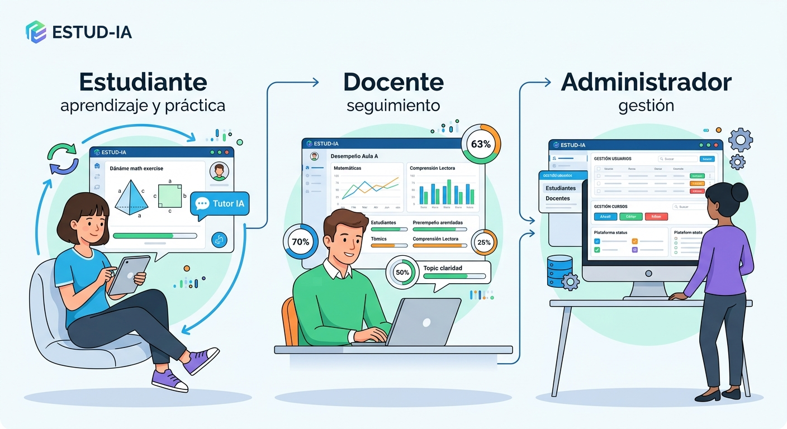

---

# 3. Experiencia y diseño de interfaces

El diseño de ESTUD-IA se trabajó previamente a la implementación, con el objetivo de definir la estructura de las pantallas, la navegación y la experiencia que tendría cada tipo de usuario.

Durante esta etapa se utilizaron **Google Stitch** y **Figma** con diferentes propósitos. Primero se realizaron exploraciones visuales y bocetos iniciales para plantear las principales ideas de la interfaz. Posteriormente, estas propuestas se organizaron y llevaron a un prototipo navegable en Figma.

Los principales criterios considerados fueron:

- Diseño **mobile first**.
- Adaptación responsive.
- Navegación sencilla e intuitiva.
- Buena legibilidad y contraste.
- Componentes visuales consistentes.
- Estados de carga, error y éxito.
- Interfaz sencilla para facilitar el uso por parte de los estudiantes.

## Google Stitch: exploración inicial

**Google Stitch** se utilizó durante las primeras etapas del proyecto como herramienta de apoyo para explorar rápidamente diferentes propuestas de interfaz mediante Inteligencia Artificial.

A partir de estas exploraciones se obtuvieron **bocetos y mockups iniciales** que ayudaron al equipo a visualizar cómo podrían organizarse las principales pantallas de ESTUD-IA antes de definir el diseño final.

Esta etapa permitió probar diferentes distribuciones, estilos y elementos de la interfaz de manera rápida, utilizando las propuestas generadas como referencia para continuar con el diseño.

### Proyecto en Google Stitch

[Ver exploraciones iniciales de ESTUD-IA en Google Stitch](https://stitch.withgoogle.com/projects/12456477824584293891)

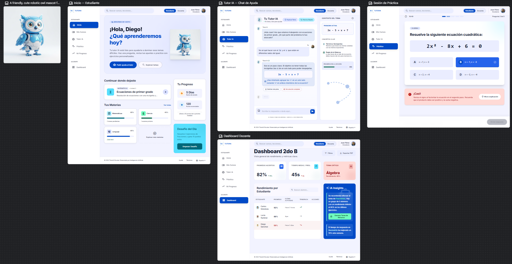

## Figma: prototipo de la aplicación

Después de la etapa de exploración inicial, **Figma** se utilizó para estructurar y consolidar las propuestas de diseño en un **prototipo navegable**.

En Figma se definieron las principales pantallas, componentes visuales y flujos de navegación de ESTUD-IA, permitiendo simular la interacción del usuario antes de comenzar la implementación.

El prototipo sirvió como referencia visual para el desarrollo del Front-End y permitió validar la organización de las interfaces y los principales recorridos de usuario.

### Prototipo

[Ver prototipo de ESTUD-IA en Figma](https://www.figma.com/make/t1DSBAAx1dcnDfEv4YV5Y3/TutorIA-Escolar-UI-UX-Brief)

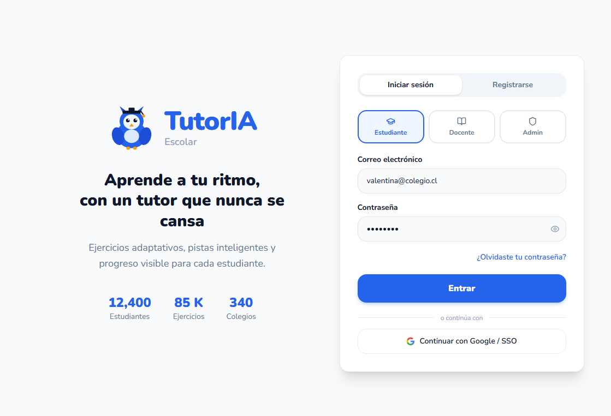

## Interfaces principales

Las principales interfaces consideradas para el proyecto son:

| Interfaz | Descripción |
| --- | --- |
| **Inicio de sesión** | Permite al usuario ingresar a la plataforma según su rol. |
| **Panel del estudiante** | Presenta el progreso, continuidad de aprendizaje y principales indicadores. |
| **Tutor IA** | Permite realizar consultas y recibir orientación. |
| **Práctica** | Permite resolver ejercicios y solicitar pistas. |
| **Resultados** | Permite revisar el desempeño obtenido en los ejercicios. |
| **Mi perfil** | Presenta información relacionada con el progreso y logros. |
| **Panel docente** | Permite consultar cursos y métricas de las aulas. |
| **Panel administrativo** | Permite consultar información general y gestionar usuarios y cursos. |

### Capturas de las interfaces

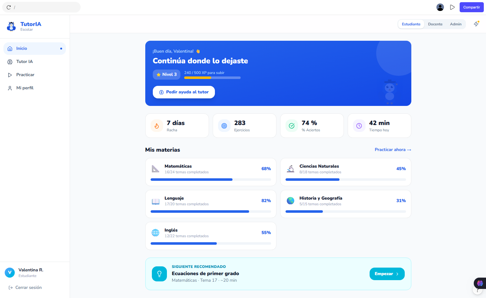

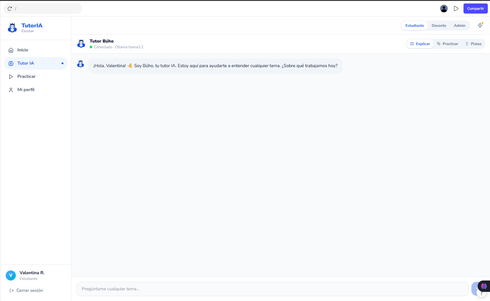

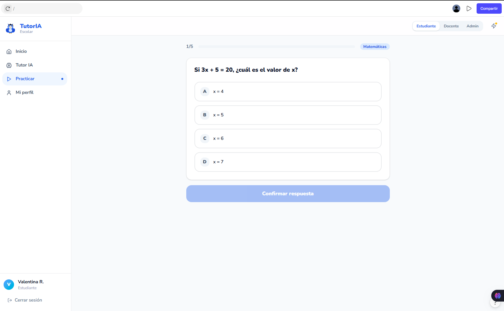

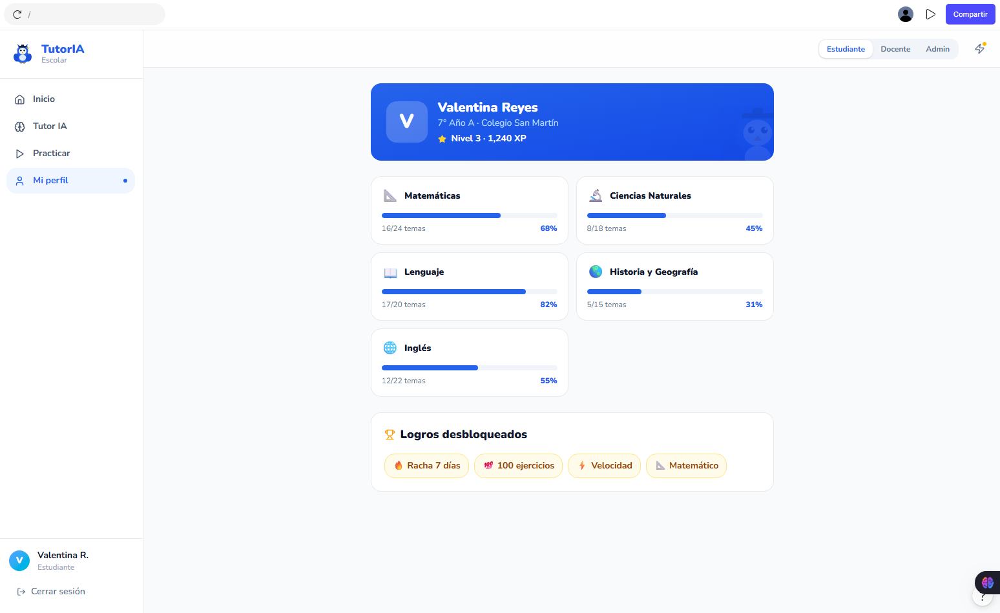

---

# 4. Metodología Scrum

El desarrollo de ESTUD-IA utiliza **Scrum** como marco de trabajo para organizar las actividades del equipo y avanzar de manera incremental.

La metodología permite dividir el desarrollo en periodos de trabajo, priorizar las funcionalidades más importantes y revisar continuamente el avance del producto.

## Equipo Scrum

El equipo de ESTUD-IA está conformado por:

| Integrante | Rol | Responsabilidad principal |
| --- | --- | --- |
| **Alonso Quispe** | Product Owner / Developer | Priorizar el Product Backlog, representar las necesidades del producto y participar en el desarrollo. |
| **Jesús Rivera** | Scrum Master / Developer | Facilitar la organización del equipo, apoyar el proceso Scrum y participar en el desarrollo. |
| **Ben Alanya** | Developer | Analizar, desarrollar, probar e integrar las funcionalidades asignadas. |
| **Renato Ninatanta** | Developer | Analizar, desarrollar, probar e integrar las funcionalidades asignadas. |

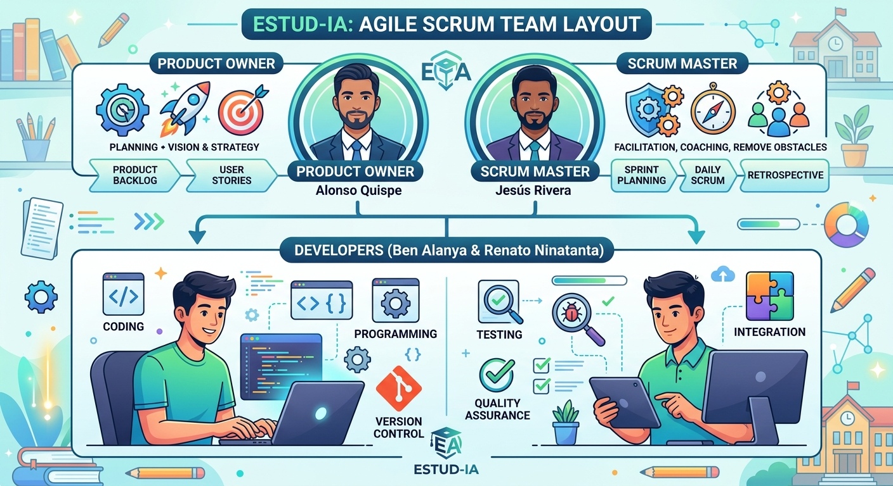

## Responsabilidades

### Product Owner

El Product Owner se encarga principalmente de mantener y priorizar el Product Backlog, buscando que el equipo trabaje primero en las funcionalidades que generan mayor valor para ESTUD-IA.

### Scrum Master

El Scrum Master facilita la organización del equipo, ayuda a mantener el proceso Scrum y apoya en la identificación y solución de impedimentos.

### Developers

Los Developers participan en el análisis, diseño, desarrollo, pruebas e integración de las funcionalidades seleccionadas para cada Sprint.

En este proyecto, algunos integrantes pueden asumir más de una responsabilidad debido al tamaño reducido del equipo.

## Product Goal

El **Product Goal** de ESTUD-IA es:

> **Permitir que alumnos urbanos y rurales revisen temas de estudio organizados por materias y resuelvan ejercicios interactivos a su propio ritmo, apoyándose en un Tutor de Inteligencia Artificial adaptativa que responde dudas y proporciona retroalimentación inmediata.**

Este objetivo orienta las decisiones del proyecto y permite determinar qué funcionalidades aportan directamente al propósito de la aplicación.

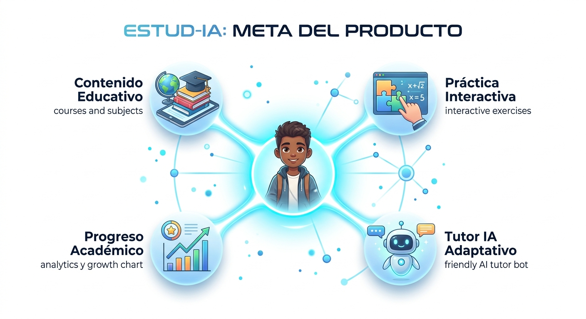

## Sprints

El desarrollo se organiza mediante Sprints, buscando entregar avances progresivos en lugar de construir todo el sistema de manera aislada.

La planificación general considera:

| Etapa | Enfoque |
| --- | --- |
| **Primer Sprint** | Construcción inicial del Front-End y flujos principales. |
| **Segundo Sprint** | Desarrollo del Back-End y servicios necesarios. |
| **Tercer Sprint** | Integración entre Front-End y Back-End. |
| **Sprint final** | Pruebas, mejoras, correcciones y preparación del despliegue. |

El objetivo es evitar desarrollar todos los componentes por separado y realizar la integración únicamente al final.

## Primer Sprint

El primer Sprint se enfoca principalmente en los roles de **Estudiante y Administrador**, priorizando la construcción de las interfaces y los principales flujos de interacción de la aplicación.

En esta primera etapa se trabaja principalmente el **Front-End**, dejando preparada la estructura visual para que las funcionalidades puedan conectarse posteriormente con el Back-End.

### Rol Estudiante

Para el estudiante se priorizan las funcionalidades relacionadas directamente con el aprendizaje y la práctica:

| Historia | Funcionalidad | Prioridad |
| --- | --- | --- |
| **HU-01** | Iniciar sesión | Alta |
| **HU-02** | Consultar cursos disponibles | Alta |
| **HU-03** | Consultar contenido del curso | Alta |
| **HU-04** | Resolver ejercicios prácticos | Alta |
| **HU-05** | Consultar al Tutor IA | Alta |
| **HU-06** | Solicitar pistas durante los ejercicios | Alta |
| **HU-07** | Consultar resultados de ejercicios | Alta |
| **HU-08** | Consultar progreso de aprendizaje | Alta |
| **HU-10** | Consultar panel principal | Media |

Estas funcionalidades permiten construir el recorrido principal del estudiante dentro de ESTUD-IA: ingresar a la plataforma, consultar sus cursos, estudiar contenidos, practicar, recibir apoyo del Tutor IA y revisar su progreso.

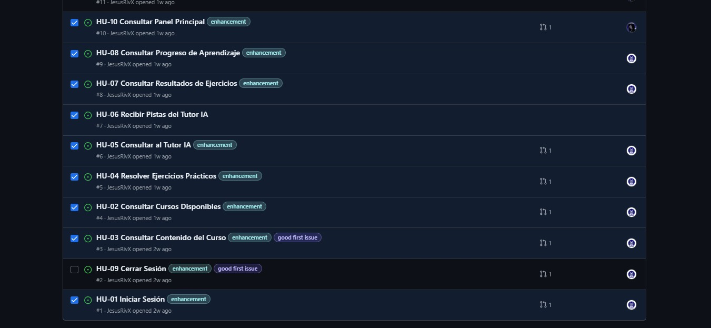

### Rol Administrador

Para el administrador se consideran inicialmente las funcionalidades necesarias para gestionar la información básica de la plataforma:

| Historia | Funcionalidad | Prioridad |
| --- | --- | --- |
| **HU-11** | Consultar usuarios | Baja |
| **HU-12** | Registrar usuario | Baja |
| **HU-13** | Actualizar información de usuario | Baja |
| **HU-17** | Consultar catálogo de cursos | Baja |
| **HU-18** | Registrar curso | Baja |
| **HU-19** | Actualizar información de curso | Baja |
| **HU-16** | Consultar panel administrativo | Baja |

Estas funcionalidades permiten establecer la estructura inicial para que el administrador pueda consultar y gestionar usuarios y cursos desde la plataforma.

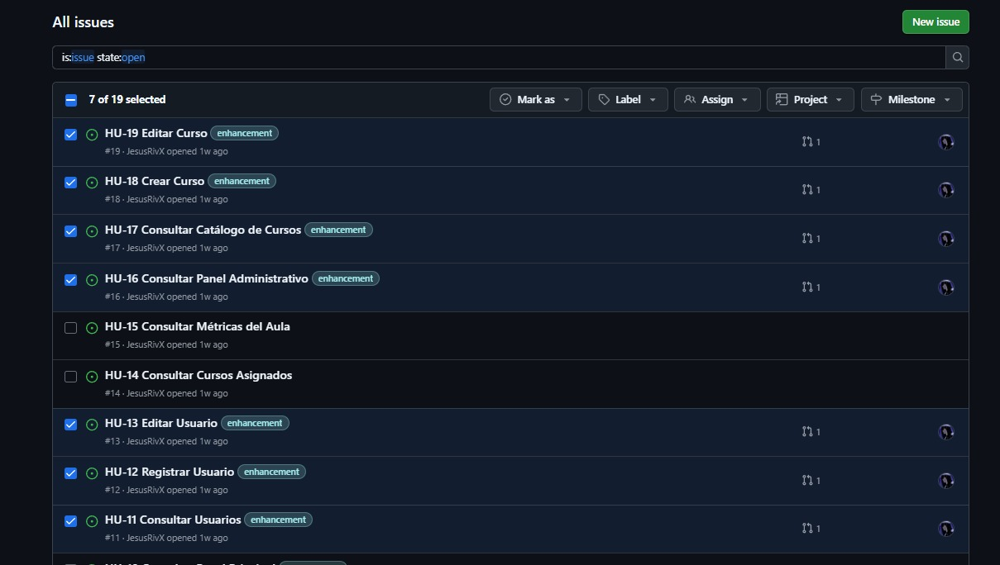

## Sprint Goal

Cada Sprint cuenta con un objetivo que permite al equipo mantener el foco durante el periodo de desarrollo.

### Sprint Goal del Primer Sprint

> **Construir la base visual y los principales flujos de interacción de ESTUD-IA para los roles de estudiante y administrador, dejando preparada la estructura del Front-End para su posterior integración con el Back-End.**

El objetivo de esta primera etapa no es completar toda la aplicación, sino construir una base funcional y visual que permita continuar con el desarrollo en los siguientes Sprints.

## Sprint Backlog

El Sprint Backlog contiene las Historias de Usuario seleccionadas para el Sprint y las tareas necesarias para desarrollarlas.

Para el Primer Sprint, el trabajo se organiza principalmente en dos grupos:

- **Estudiante:** funcionalidades relacionadas con el acceso, aprendizaje, práctica, Tutor IA y seguimiento del progreso.
- **Administrador:** funcionalidades relacionadas con la gestión inicial de usuarios, cursos y panel administrativo.

El equipo utiliza **GitHub Projects** para organizar y visualizar el trabajo del Sprint, permitiendo identificar las tareas pendientes, en desarrollo y terminadas.

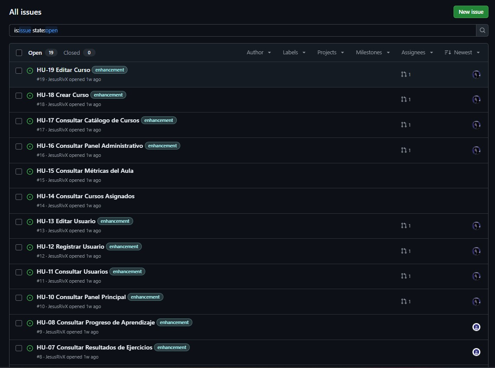

## Definition of Done

Una Historia de Usuario se considera terminada cuando cumple las condiciones establecidas por el equipo.

Como mínimo:
* La funcionalidad fue desarrollada.
* Cumple los criterios de aceptación.
* Fue revisada por otro integrante.
* No presenta errores conocidos que impidan su funcionamiento.
* Los cambios fueron integrados correctamente.
* La funcionalidad puede demostrarse.

---

## 5. Product Backlog

El Product Backlog reúne las funcionalidades necesarias para desarrollar ESTUD-IA y permite ordenar el trabajo según su prioridad y valor para el producto.

Actualmente está compuesto por:
* 19 Historias de Usuario
* 8 Épicas
* 76 Story Points

Las Historias de Usuario fueron priorizadas considerando principalmente el valor que aportan al estudiante y la evolución necesaria para construir progresivamente la plataforma.

### Resumen del Product Backlog

| Prioridad | Historias | Puntos |
| :--- | :--- | :--- |
| Alta | 8 | 40 |
| Media | 2 | 5 |
| Baja | 9 | 31 |
| **Total** | **19** | **76** |

### Épicas

| Épica | Funcionalidad principal |
| :--- | :--- |
| Autenticación de Usuarios | Inicio y cierre de sesión. |
| Gestión Académica | Consulta y administración de cursos. |
| Gestión de Contenido | Consulta de contenidos educativos. |
| Práctica y Evaluación | Resolución y consulta de resultados de ejercicios. |
| Progreso Académico | Consulta del avance de aprendizaje. |
| Tutor IA | Consultas y solicitud de pistas. |
| Paneles y Accesos | Información diferenciada según el rol. |
| Gestión de Usuarios | Consulta, registro y actualización de usuarios. |

### Product Backlog completo

[Ver Product Backlog e Historias de Usuario](https://utpedupe-my.sharepoint.com/:x:/g/personal/u21213646_utp_edu_pe/IQAbAZzNbjATQJbXT9jw_o-iAYPzDHymYvWIFzLT875iL4A?e=jtmpc3)

El archivo contiene el detalle de las Historias de Usuario y sus criterios de aceptación.

## 6. Tecnologías y herramientas

ESTUD-IA utiliza tecnologías web que permiten separar la interfaz, la lógica de negocio, la persistencia de información y el componente de Inteligencia Artificial.

### Front-End

| Tecnología | Uso |
| :--- | :--- |
| **React** | Construcción de interfaces mediante componentes reutilizables. |
| **Vite** | Entorno de desarrollo y construcción del Front-End. |
| **Tailwind CSS** | Diseño y estilos de la interfaz. |
| **React Router** | Gestión de rutas y navegación. |
| **Axios** | Comunicación HTTP con el Back-End. |
| **Lucide React** | Iconografía de la aplicación. |

### Back-End

| Tecnología | Uso |
| :--- | :--- |
| **Laravel** | Desarrollo de la API y lógica de negocio. |
| **PHP** | Lenguaje utilizado en el Back-End. |
| **Laravel Sanctum** | Autenticación de usuarios. |
| **Scramble** | Documentación de la API mediante OpenAPI. |
| **PhpUnit** | Pruebas automatizadas. |

### Base de datos

| Tecnología | Uso |
| :--- | :--- |
| **MySQL** | Persistencia de usuarios, cursos, contenidos, ejercicios y progreso. |

La base de datos utiliza un modelo relacional debido a la relación existente entre usuarios, roles, cursos, contenidos, ejercicios y resultados.

### Inteligencia Artificial

Para el componente de Tutor IA se contempla el uso de:

| Tecnología | Uso |
| :--- | :--- |
| **Ollama** | Ejecución local del modelo de Inteligencia Artificial. |
| **llama3.2** | Modelo utilizado para las consultas del Tutor IA. |
| **cloudstudio/ollama-laravel** | Integración entre Laravel y Ollama. |

La ejecución local del modelo busca reducir los costos de operación y evitar que las consultas educativas tengan que enviarse a un servicio externo.

La integración completa del Tutor IA se encuentra en proceso de desarrollo.

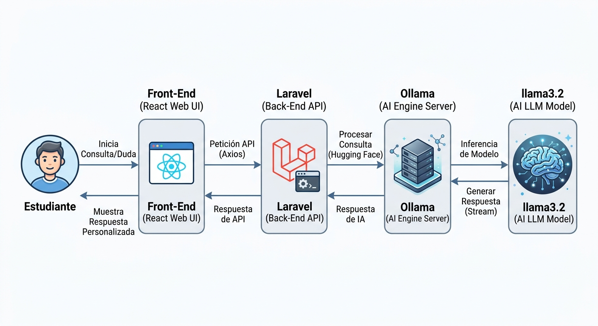

### Herramientas de desarrollo

| Herramienta | Uso |
| :--- | :--- |
| **Visual Studio Code** | Desarrollo del código fuente de la aplicación. |
| **Git** | Control de versiones. |
| **GitHub** | Repositorio y colaboración del equipo. |
| **GitHub Issues** | Gestión de Historias de Usuario y tareas. |
| **GitHub Projects** | Organización y seguimiento del trabajo. |
| **Figma** | Diseño y prototipado de interfaces. |
| **Google Stitch** | Apoyo en exploración y generación de interfaces mediante IA. |

## 7. Arquitectura

ESTUD-IA utiliza una arquitectura web separada por responsabilidades.

La solución está compuesta principalmente por:
* **Front-End:** desarrollado con React.
* **Back-End:** desarrollado con Laravel.
* **Base de datos:** MySQL.
* **Inteligencia Artificial:** servicio local mediante Ollama.

### Diagrama de arquitectura

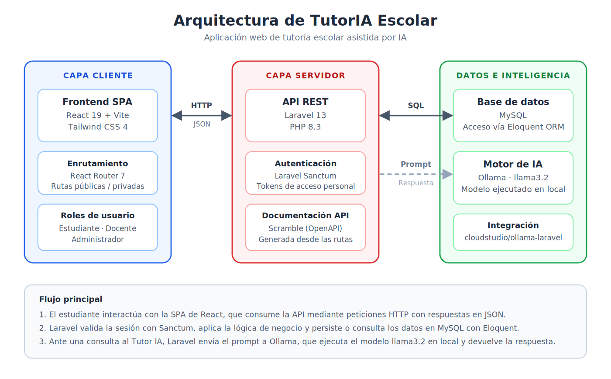

### Componentes principales

#### Front-End
El Front-End se encarga de presentar la interfaz al usuario, gestionar la navegación y consumir los servicios proporcionados por el Back-End.

#### Back-End
El Back-End concentra la lógica de negocio, autenticación, validaciones y comunicación con la base de datos y el servicio de Inteligencia Artificial.

#### Base de datos
MySQL permite almacenar y relacionar la información necesaria para el funcionamiento de la plataforma.

#### Inteligencia Artificial
Ollama permite ejecutar el modelo de IA localmente y utilizarlo como parte del Tutor IA.

## 8. Estructura del repositorio

El repositorio se divide principalmente entre el Front-End, Back-End y documentación.

```text
ESTUD-IA/
│
├── Backend-TutorIA/
│   ├── app/
│   │   ├── Http/
│   │   │   └── Controllers/
│   │   ├── Models/
│   │   └── Providers/
│   │
│   ├── database/
│   │   ├── migrations/
│   │   └── seeders/
│   │
│   ├── routes/
│   │   ├── api.php
│   │   └── web.php
│   │
│   └── tests/
│
├── FrontEnd-TutorIA/
│   ├── src/
│   │   ├── routes/
│   │   ├── styles/
│   │   └── assets/
│   │
│   └── public/
│
└── docs/
    └── img/
```

> **Nota:** La separación de directorios permite trabajar de forma independiente en cada capa de la aplicación y facilita la integración continua del proyecto.

---

## 9. Control de versiones y GitFlow

El equipo utiliza Git y GitHub para controlar las versiones del código, gestionar las Historias de Usuario y revisar los cambios antes de integrarlos.

Cada Historia de Usuario se relaciona con un Issue y se desarrolla en una rama independiente.

### Flujo de trabajo

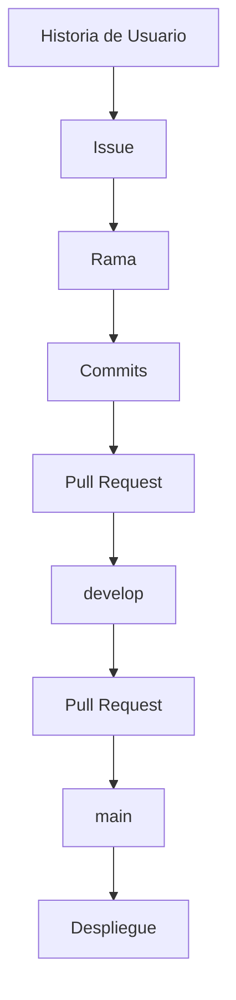
```mermaid
graph TD
    HU[Historia de Usuario] --> Issue[Issue]
    Issue --> Rama[Rama]
    Rama --> Commits[Commits]
    Commits --> PR1[Pull Request]
    PR1 --> Develop[develop]
    Develop --> PR2[Pull Request]
    PR2 --> Main[main]
    Main --> Despliegue[Despliegue]
```

Este flujo permite relacionar cada cambio realizado en el código con una funcionalidad concreta del Product Backlog.

### GitFlow del proyecto

El siguiente diagrama representa el flujo de trabajo utilizado por el equipo durante el desarrollo.

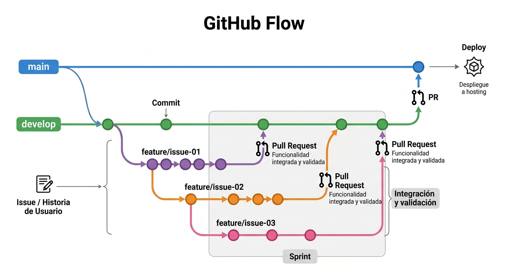

El flujo busca que los cambios pasen por una revisión antes de incorporarse a las ramas principales del proyecto.

### Convención de ramas

El equipo utiliza una nomenclatura para identificar el propósito de cada rama:

| Prefijo | Uso | Ejemplo |
| :--- | :--- | :--- |
| feature/ | Nueva funcionalidad del backlog. | feature/hu-05-tutor-ia |
| fix/ | Corrección de errores. | fix/validacion-login |
| docs/ | Cambios en documentación. | docs/readme |
| refactor/ | Reorganización del código sin cambiar su comportamiento. | refactor/api-auth |

### Pull Requests

Los Pull Requests permiten revisar los cambios antes de integrarlos.

El flujo utilizado es:

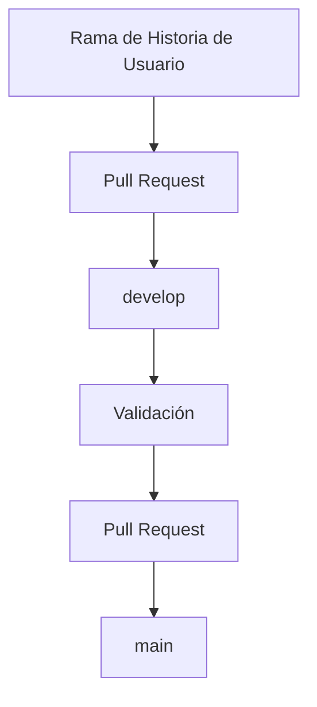
```mermaid
graph TD
    RamaHU[Rama de Historia de Usuario] --> PR1[Pull Request]
    PR1 --> Develop[develop]
    Develop --> Validacion[Validación]
    Validacion --> PR2[Pull Request]
    PR2 --> Main[main]
```

Cada Pull Request debe describir el cambio realizado y relacionarse con la Historia de Usuario o Issue correspondiente.

La revisión por otro integrante ayuda a detectar errores y mantener una mejor calidad del código.

---

## 10. Cómo ejecutar el proyecto

### Requisitos previos

Antes de ejecutar el proyecto se necesita tener instalado:

* PHP 8.3 o superior.
* Composer.
* Node.js 20 o superior.
* npm.
* MySQL.
* Ollama, para la funcionalidad de Inteligencia Artificial.

**Importante:** El proyecto no utiliza Docker.

### 1. Clonar el repositorio

```bash
git clone <URL_DEL_REPOSITORIO>
cd ESTUD-IA
```

### 2. Configurar el Back-End

Ingresar a la carpeta del Back-End:

```bash
cd Backend-TutorIA
```

Instalar las dependencias:

```bash
composer install
```

Crear el archivo de configuración:

```bash
cp .env.example .env
```

Generar la clave de la aplicación:

```bash
php artisan key:generate
```

#### Configurar la base de datos

Crear una base de datos MySQL y configurar las credenciales en el archivo `.env`:

```env
DB_CONNECTION=mysql
DB_HOST=127.0.0.1
DB_PORT=3306
DB_DATABASE=backend_tutoria
DB_USERNAME=root
DB_PASSWORD=
```

Ejecutar las migraciones:

```bash
php artisan migrate
```

Iniciar el servidor del Back-End:

```bash
php artisan serve
```

La API estará disponible en: `http://localhost:8000`

### 3. Configurar el Front-End

En otra terminal, ingresar a la carpeta del Front-End:

```bash
cd FrontEnd-TutorIA
```

Instalar las dependencias:

```bash
npm install
```

Iniciar el servidor de desarrollo:

```bash
npm run dev
```

La aplicación estará disponible en: `http://localhost:5173`

### 4. Configurar el Tutor IA

Para utilizar el modelo local de Inteligencia Artificial:

```bash
ollama pull llama3.2
```

Luego iniciar Ollama:

```bash
ollama serve
```

Una vez configurado, Laravel podrá comunicarse con Ollama para procesar las consultas del Tutor IA.

## Equipo

| Integrante | Rol |
| --- | --- |
| Jesús Rivera | Desarrollo |
| Alonso Quispe | Desarrollo |
| Renato Ninatanta | Desarrollo |
| Ben Alanya | Desarrollo |

---

Proyecto académico desarrollado para el curso Curso Integrador II: Software de la
Universidad Tecnológica del Perú.
