# ESTUD-IA

Sistema Inteligente de Apoyo Pedagógico y Gestión del Aprendizaje para Instituciones Educativas

**ESTUD-IA** es una plataforma web de acompañamiento pedagógico que busca apoyar a los estudiantes dentro y fuera del aula mediante contenidos educativos, ejercicios interactivos, seguimiento del progreso y un **Tutor de Inteligencia Artificial**.

La propuesta está orientada principalmente a estudiantes que presentan dificultades de aprendizaje en áreas como **Matemática y Comprensión Lectora**, brindándoles la posibilidad de aprender y practicar a su propio ritmo.

**Curso Integrador II: Software** — Universidad Tecnológica del Perú

[Estud-IA](https://estud-ia-integrador.vercel.app/)

---

## Tabla de contenido

- [1. Sobre el proyecto](#1-sobre-el-proyecto)
- [2. Metodología Scrum](#2-metodología-scrum)
  - [Equipo Scrum](#equipo-scrum)
  - [Product Backlog](#product-backlog)
    - [Resumen del Product Backlog](#resumen-del-product-backlog)
    - [Épicas](#épicas)
    - [Product Backlog completo](#product-backlog-completo)
  - [Product Goal](#product-goal)
  - [Sprints](#sprints)
  - [Primer Sprint](#primer-sprint)
    - [Rol Estudiante](#rol-estudiante)
    - [Rol Administrador](#rol-administrador)
  - [Sprint Goal](#sprint-goal)
    - [Sprint Goal del Primer Sprint](#sprint-goal-del-primer-sprint)
  - [Sprint Backlog](#sprint-backlog)
  - [Definition of Done](#definition-of-done)

- [3. Arquitectura del software](#3-arquitectura-del-software)
  - [Diagrama de arquitectura](#diagrama-de-arquitectura)
  - [Arquitectura general](#arquitectura-general)
  - [Componentes principales](#componentes-principales)
    - [Front-End](#front-end)
    - [Back-End](#back-end)
    - [Base de datos](#base-de-datos)
    - [Inteligencia Artificial](#inteligencia-artificial)
  - [Flujo de comunicación entre componentes](#flujo-de-comunicación-entre-componentes)

- [4. Seguridad del software](#4-seguridad-del-software)
  - [Autenticación y autorización](#autenticación-y-autorización)
  - [Protección de datos](#protección-de-datos)
  - [Validación de entradas](#validación-de-entradas)
  - [Gestión de credenciales y secretos](#gestión-de-credenciales-y-secretos)
  - [Seguridad de las integraciones con IA](#seguridad-de-las-integraciones-con-ia)

- [5. Pruebas de software](#5-pruebas-de-software)
  - [Estrategia de pruebas](#estrategia-de-pruebas)
  - [Pruebas funcionales](#pruebas-funcionales)
    - [Pruebas unitarias](#pruebas-unitarias)
    - [Pruebas de integración](#pruebas-de-integración)
    - [Pruebas de sistema](#pruebas-de-sistema)
    - [Pruebas de aceptación](#pruebas-de-aceptación)
  - [Pruebas no funcionales](#pruebas-no-funcionales)
    - [Pruebas de rendimiento](#pruebas-de-rendimiento)
    - [Pruebas de seguridad](#pruebas-de-seguridad)
    - [Pruebas de usabilidad](#pruebas-de-usabilidad)
    - [Pruebas de compatibilidad](#pruebas-de-compatibilidad)
  - [Casos de prueba](#casos-de-prueba)
  - [Criterios de aceptación](#criterios-de-aceptación)

---

# 1. Sobre el proyecto

ESTUD-IA nace como una propuesta para brindar **acompañamiento académico personalizado** a estudiantes que necesitan reforzar sus conocimientos dentro y/o fuera del horario habitual de clases.

La aplicación combina contenidos educativos, ejercicios interactivos, seguimiento del progreso y un Tutor IA que puede responder dudas y proporcionar orientación durante el aprendizaje.

El proyecto considera también las diferencias de acceso tecnológico existentes entre contextos urbanos y rurales. Por ello, se busca que la plataforma sea **responsive, ligera, sencilla de utilizar y adaptable a diferentes dispositivos**.

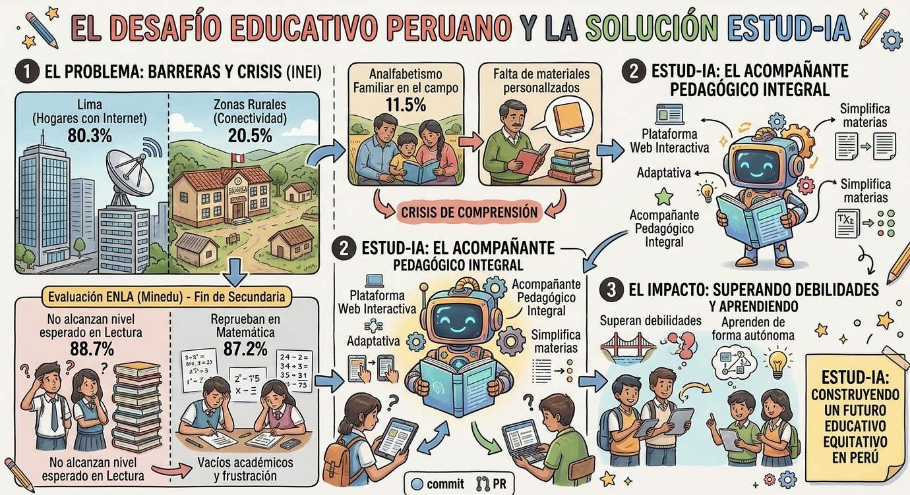

La finalidad no es reemplazar al docente, sino proporcionar al estudiante una herramienta de apoyo que pueda utilizar cuando necesite practicar, reforzar un tema o resolver una duda.

---

# 2. Metodología Scrum 

El desarrollo de ESTUD-IA utiliza **Scrum** como marco de trabajo para organizar las actividades del equipo y avanzar de manera incremental.

La metodología permite dividir el desarrollo en periodos de trabajo, priorizar las funcionalidades más importantes y revisar continuamente el avance del producto.

## Equipo Scrum

| Integrante | Rol | Responsabilidad principal |
| --- | --- | --- |
| **Alonso Quispe** | Product Owner / Developer | Priorizar el Product Backlog, representar las necesidades del producto y participar en el desarrollo. |
| **Jesús Rivera** | Scrum Master / Developer | Facilitar la organización del equipo, apoyar el proceso Scrum y participar en el desarrollo. |
| **Ben Alanya** | Developer | Analizar, desarrollar, probar e integrar las funcionalidades asignadas. |
| **Renato Ninatanta** | Developer | Analizar, desarrollar, probar e integrar las funcionalidades asignadas. |

En este proyecto, algunos integrantes pueden asumir más de una responsabilidad debido al tamaño reducido del equipo.

## Product Backlog

El Product Backlog reúne las funcionalidades necesarias para desarrollar ESTUD-IA y permite ordenar el trabajo según su prioridad y valor para el producto.

Actualmente está compuesto por:
- 19 Historias de Usuario
- 8 Épicas
- 76 Story Points

Las Historias de Usuario fueron priorizadas considerando principalmente el valor que aportan al estudiante y la evolución necesaria para construir progresivamente la plataforma.

### Resumen del Product Backlog

| Prioridad | Historias | Puntos |
| :--- | :--- | :--- |
| Alta | 8 | 40 |
| Media | 2 | 5 |
| Baja | 9 | 31 |
| **Total** | **19** | **76** |

### Épicas

| Épica | Funcionalidad principal |
| :--- | :--- |
| Autenticación de Usuarios | Inicio y cierre de sesión. |
| Gestión Académica | Consulta y administración de cursos. |
| Gestión de Contenido | Consulta de contenidos educativos. |
| Práctica y Evaluación | Resolución y consulta de resultados de ejercicios. |
| Progreso Académico | Consulta del avance de aprendizaje. |
| Tutor IA | Consultas y solicitud de pistas. |
| Paneles y Accesos | Información diferenciada según el rol. |
| Gestión de Usuarios | Consulta, registro y actualización de usuarios. |

### Product Backlog completo

[Ver Product Backlog e Historias de Usuario](https://utpedupe-my.sharepoint.com/:x:/g/personal/u21213646_utp_edu_pe/IQAbAZzNbjATQJbXT9jw_o-iAYPzDHymYvWIFzLT875iL4A?e=jtmpc3)

El archivo contiene el detalle de las Historias de Usuario y sus criterios de aceptación.

## Product Goal

El **Product Goal** de ESTUD-IA es:

> **Permitir que alumnos urbanos y rurales revisen temas de estudio organizados por materias y resuelvan ejercicios interactivos a su propio ritmo, apoyándose en un Tutor de Inteligencia Artificial adaptativa que responde dudas y proporciona retroalimentación inmediata.**

Este objetivo orienta las decisiones del proyecto y permite determinar qué funcionalidades aportan directamente al propósito de la aplicación.

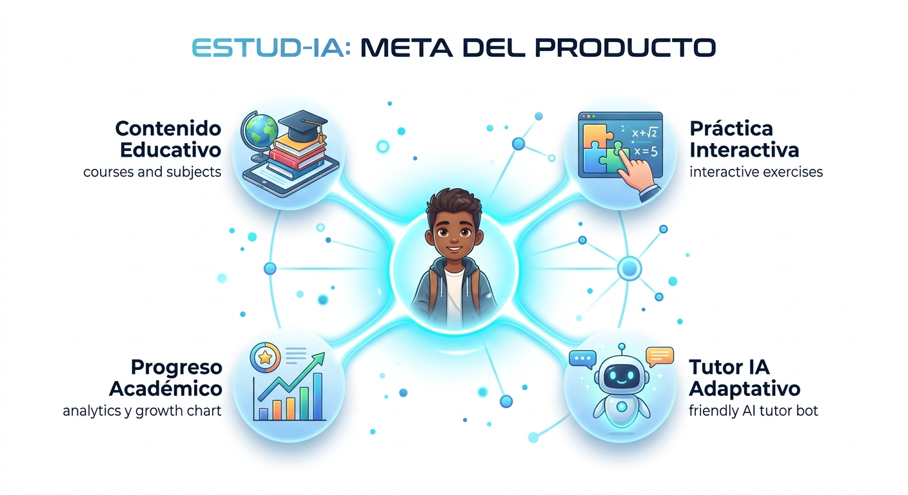

## Sprints

El desarrollo se organiza mediante Sprints, buscando entregar avances progresivos en lugar de construir todo el sistema de manera aislada.

La planificación general considera:

| Etapa | Enfoque |
| --- | --- |
| **Primer Sprint** | Construcción inicial del Front-End y flujos principales. |
| **Segundo Sprint** | Desarrollo del Back-End, servicios necesarios y funcionalidades de los roles Estudiante, Administrador y Docente. |
| **Tercer Sprint** | Integración entre Front-End y Back-End. |
| **Sprint final** | Pruebas, mejoras, correcciones y preparación del despliegue. |

El objetivo es evitar desarrollar todos los componentes por separado y realizar la integración únicamente al final.

## Segundo Sprint

El segundo Sprint se enfoca en **iniciar el desarrollo del Back-End de ESTUD-IA y realizar la integración inicial con el Front-End** desarrollado previamente.

Durante esta etapa se busca implementar la estructura inicial del servidor con Laravel, establecer la conexión con la base de datos MySQL y desarrollar los primeros servicios necesarios para permitir la comunicación entre ambos componentes.

Asimismo, se comienza a trabajar en las funcionalidades del rol Docente, junto con la preparación de los servicios que permitirán gestionar las operaciones de los roles Estudiante y Administrador.

### Rol Estudiante

Se consideran las funcionalidades relacionadas directamente con el aprendizaje y la práctica:

| Historia | Funcionalidad | Prioridad |
| --- | --- | --- |
| **HU-01** | Iniciar sesión | Alta |
| **HU-02** | Consultar cursos disponibles | Alta |
| **HU-03** | Consultar contenido del curso | Alta |
| **HU-04** | Resolver ejercicios prácticos | Alta |
| **HU-05** | Consultar al Tutor IA | Alta |
| **HU-06** | Solicitar pistas durante los ejercicios | Alta |
| **HU-07** | Consultar resultados de ejercicios | Alta |
| **HU-08** | Consultar progreso de aprendizaje | Alta |
| **HU-10** | Consultar panel principal | Media |

Estas funcionalidades representan los principales servicios que se prepararán para conectar las interfaces del estudiante con el Back-End.

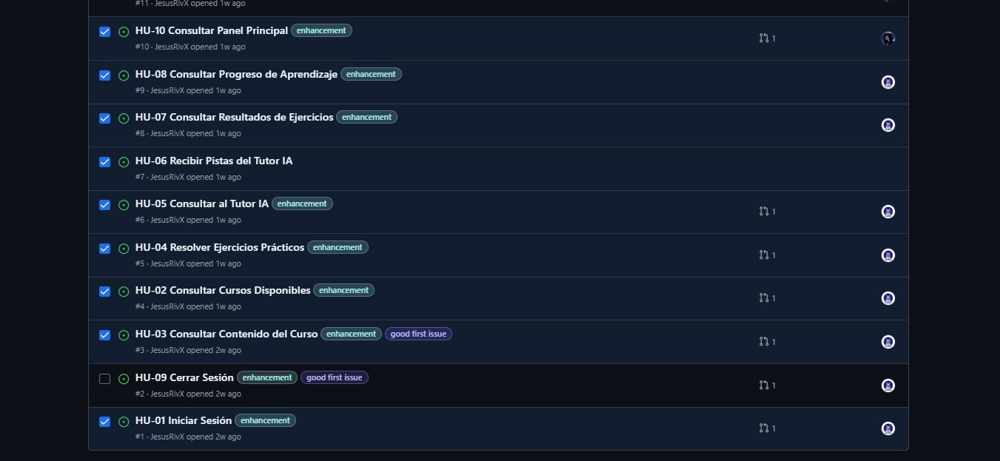

### Rol Administrador

Se consideran las funcionalidades necesarias para gestionar la información básica de la plataforma:

| Historia | Funcionalidad | Prioridad |
| --- | --- | --- |
| **HU-11** | Consultar usuarios | Baja |
| **HU-12** | Registrar usuario | Baja |
| **HU-13** | Actualizar información de usuario | Baja |
| **HU-17** | Consultar catálogo de cursos | Baja |
| **HU-18** | Registrar curso | Baja |
| **HU-19** | Actualizar información de curso | Baja |
| **HU-16** | Consultar panel administrativo | Baja |

Estas funcionalidades servirán como referencia para desarrollar progresivamente los servicios administrativos del Back-End.

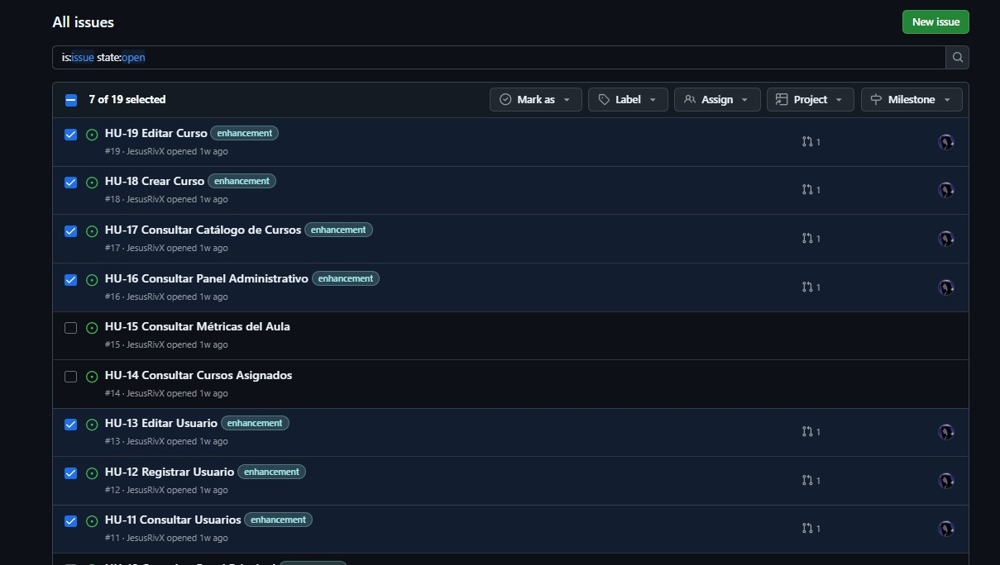

### Rol Docente

Se inicia el desarrollo de las funcionalidades del rol Docente, enfocándose en la consulta de cursos asignados y la información académica de sus aulas.

| Historia | Funcionalidad | Prioridad |
| --- | --- | --- |
| **HU-14** | Consultar cursos asignados | Baja |
| **HU-15** | Consultar métricas del aula | Baja |

Estas funcionalidades permitirán preparar los servicios para consultar los cursos asignados a cada docente, gestionar el contenido de los temas de cada curso y visualizar información relevante de sus aulas.

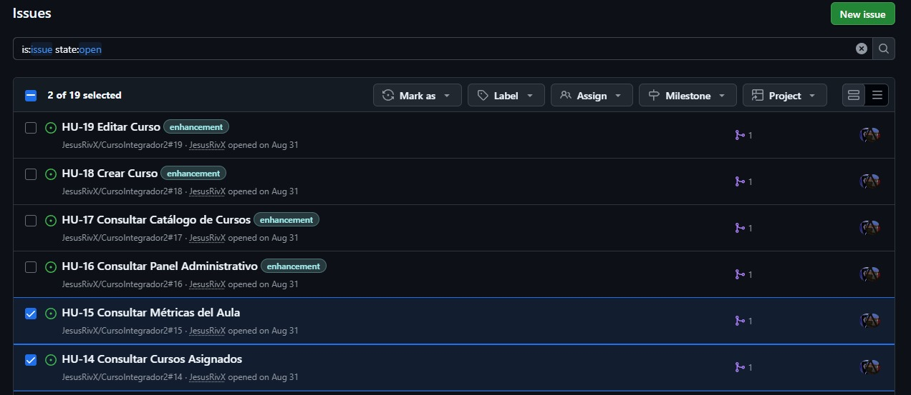

## Sprint Goal

Cada Sprint cuenta con un objetivo que permite al equipo mantener el foco durante el periodo de desarrollo.

### Sprint Goal del Segundo Sprint

> **Iniciar el desarrollo del Back-End de ESTUD-IA mediante la configuración de Laravel, la conexión con MySQL y la implementación de los primeros servicios, realizando una integración inicial con el Front-End para comenzar a conectar las interfaces existentes con la lógica de negocio y avanzar en las funcionalidades de los roles Estudiante, Administrador y Docente.**

El objetivo de esta etapa es establecer una base funcional de comunicación entre el Front-End y el Back-End, permitiendo validar progresivamente la integración de los componentes y preparar el desarrollo de las funcionalidades restantes.

## Sprint Backlog

El Sprint Backlog contiene las Historias de Usuario seleccionadas para el Sprint y las tareas necesarias para desarrollar el Back-End y realizar su integración inicial con el Front-End.

Para el Segundo Sprint, el trabajo se organiza en los siguientes grupos:

- **Back-End:** configuración inicial de Laravel, conexión con MySQL, creación de rutas, controladores y servicios, implementación inicial de la lógica de negocio y validación de solicitudes.
- **Integración Front-End y Back-End:** configuración de la comunicación entre ambos componentes, conexión de las primeras interfaces con los servicios disponibles y verificación del intercambio de datos.
- **Estudiante:** preparación de los servicios necesarios para el acceso, la consulta de cursos, los contenidos educativos, los ejercicios y el seguimiento del progreso.
- **Administrador:** preparación de los servicios para consultar, registrar y actualizar usuarios, así como consultar y gestionar cursos.
- **Docente:** inicio de los servicios para consultar cursos asignados y preparar la gestión de contenidos temáticos y la consulta de métricas de las aulas.

### Actividades técnicas del Segundo Sprint

- Configurar la estructura inicial del Back-End con Laravel.
- Establecer la conexión con la base de datos MySQL.
- Crear las primeras rutas, controladores y servicios.
- Implementar las primeras operaciones de consulta y procesamiento de datos.
- Configurar la comunicación entre el Front-End y el Back-End.
- Conectar las primeras interfaces con los servicios desarrollados.
- Verificar el intercambio de datos entre ambos componentes.
- Preparar los servicios correspondientes a los roles Estudiante y Administrador.
- Iniciar el desarrollo de los servicios del rol Docente para consultar cursos asignados.
- Preparar la gestión del contenido de los temas y la consulta de métricas de las aulas.
- Realizar pruebas iniciales de integración y corregir los errores identificados.

El equipo utiliza **GitHub Projects** para organizar y visualizar el trabajo del Sprint, permitiendo identificar las tareas pendientes, en desarrollo y terminadas.

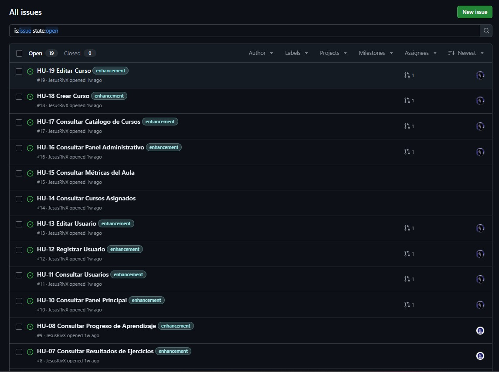

## Definition of Done

Una Historia de Usuario se considera terminada cuando cumple las condiciones establecidas por el equipo.

Como mínimo:

- La funcionalidad fue desarrollada.
- Cumple los criterios de aceptación.
- Fue revisada por otro integrante.
- No presenta errores conocidos que impidan su funcionamiento.
- Los cambios fueron integrados correctamente.
- La funcionalidad puede demostrarse.

---

# 3. Arquitectura del software

ESTUD-IA utiliza una arquitectura web organizada por componentes y separada por responsabilidades, permitiendo estructurar la interfaz de usuario, la lógica de negocio, el almacenamiento de datos y los servicios de inteligencia artificial.

La solución está compuesta principalmente por:
- **Front-End:** desarrollado con React.
- **Back-End:** desarrollado con Laravel.
- **Base de datos:** MySQL.
- **Inteligencia Artificial:** servicio local mediante Ollama.

## Diagrama de arquitectura

## Arquitectura general

La arquitectura de ESTUD-IA sigue un modelo cliente-servidor, en el que el Front-End se comunica con el Back-End para solicitar información y ejecutar las operaciones necesarias para el funcionamiento de la plataforma.

El Back-End procesa las solicitudes, aplica la lógica de negocio y se comunica con la base de datos MySQL y el servicio de inteligencia artificial cuando corresponde.

## Componentes principales

### Front-End y Back-End

El **Front-End**, desarrollado con React, se encarga de presentar las interfaces, gestionar la navegación y permitir la interacción de los usuarios con las funcionalidades de ESTUD-IA.

El **Back-End**, desarrollado con Laravel, procesa las solicitudes recibidas desde el Front-End, ejecuta la lógica de negocio, valida los datos y gestiona la comunicación con la base de datos y los servicios de inteligencia artificial.

Ambos componentes se comunican mediante solicitudes HTTP a través de endpoints, permitiendo intercambiar información y conectar progresivamente las interfaces con las funcionalidades del sistema.

#### Flujo del endpoint

### Base de datos

MySQL se utiliza para almacenar y relacionar la información necesaria para el funcionamiento de ESTUD-IA, incluyendo los datos de los usuarios, los cursos, los contenidos educativos y el progreso académico.

El Back-End gestiona las operaciones de consulta y modificación de los datos, manteniendo la comunicación con la base de datos centralizada.

#### Diagrama entidad-relación

### Inteligencia Artificial

Ollama permite ejecutar modelos de inteligencia artificial localmente y utilizar sus capacidades como parte del Tutor IA de ESTUD-IA.

Este componente está orientado a proporcionar respuestas a consultas académicas y ofrecer apoyo durante el aprendizaje, de acuerdo con la integración implementada en el Back-End.

---

# 4. Seguridad del software

ESTUD-IA considera mecanismos de seguridad orientados a proteger el acceso a la plataforma, controlar las operaciones disponibles para cada usuario, validar la información recibida y facilitar la trazabilidad de las solicitudes. Además, se contempla el análisis de vulnerabilidades mediante herramientas y prácticas de seguridad.

## Autenticación y autorización

ESTUD-IA utiliza **Laravel Sanctum** para gestionar la autenticación y **middlewares** para controlar el acceso a las rutas y funcionalidades protegidas del sistema.

Estos mecanismos permiten verificar la identidad del usuario y restringir el acceso según las condiciones definidas para cada operación, contribuyendo a proteger los recursos de los roles Estudiante, Administrador y Docente.

### Flujo de autenticación y autorización

El flujo de los endpoints permite visualizar cómo se procesan las solicitudes desde el Front-End hacia el Back-End y cómo se aplican los controles correspondientes antes de ejecutar una operación.

## Protección de datos

La protección de los datos se considera durante el procesamiento de las solicitudes y el acceso a los recursos de la plataforma. El Back-End centraliza la lógica de negocio y las operaciones sobre la información, permitiendo aplicar controles de acceso y validaciones antes de procesar los datos.

## Validación de entradas

Laravel proporciona mecanismos de validación para comprobar que los datos recibidos desde el Front-End cumplan con las reglas establecidas antes de ser procesados por el Back-End.

Estas validaciones permiten verificar campos obligatorios, formatos, tipos de datos y otras condiciones necesarias para reducir el riesgo de errores y entradas maliciosas.

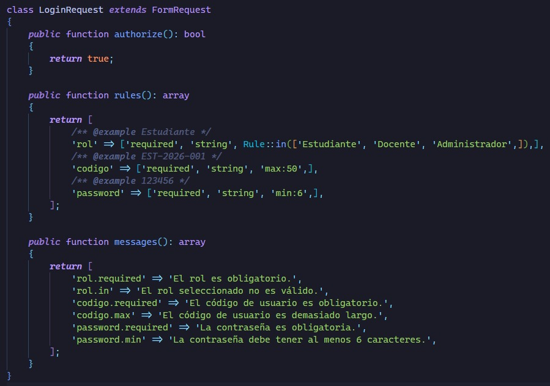

## Gestión de credenciales y secretos

La gestión de credenciales y secretos contempla el tratamiento de la información sensible necesaria para la configuración y ejecución del sistema, como las credenciales de la base de datos y las claves de los servicios utilizados.

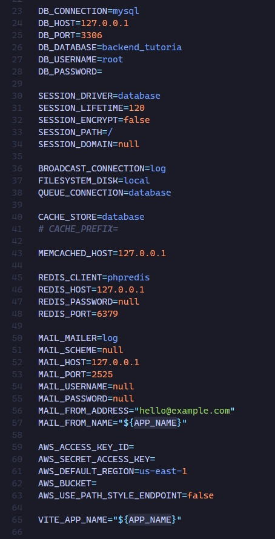

## Trazabilidad y monitoreo con Laravel Telescope

ESTUD-IA utiliza **Laravel Telescope** como herramienta de observación y trazabilidad durante el desarrollo del Back-End. Permite inspeccionar solicitudes HTTP, consultas a la base de datos, excepciones y otros eventos registrados por la aplicación, facilitando el seguimiento del comportamiento del sistema y la identificación de errores.

### Vista general de Telescope

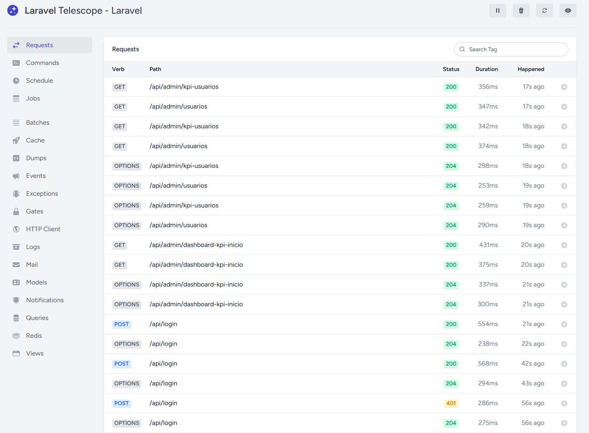

### Detalle de los registros

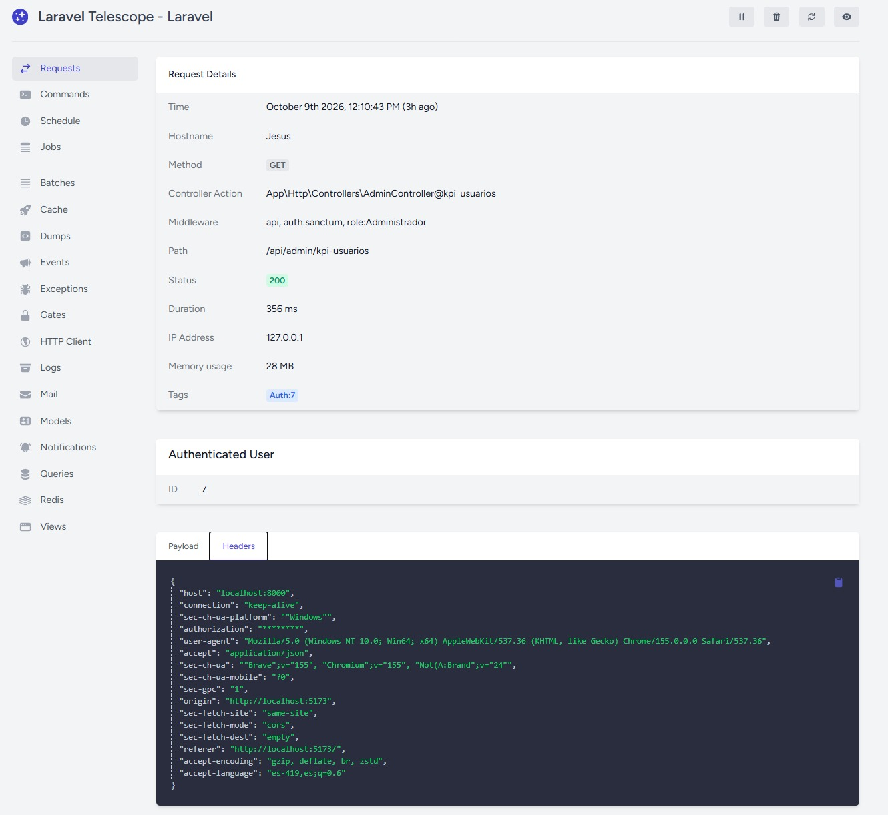

La información recopilada permite analizar el recorrido de las solicitudes y detectar comportamientos inesperados durante las pruebas y el desarrollo. El acceso a Telescope debe restringirse en entornos sensibles para evitar la exposición de datos confidenciales.

---

# 5. Pruebas de software

Las pruebas de software de ESTUD-IA permiten verificar el funcionamiento de los componentes de la aplicación, comprobar la comunicación entre el Front-End y el Back-End e identificar posibles errores durante el desarrollo.

La estrategia contempla pruebas unitarias, pruebas de extremo a extremo (E2E), pruebas de regresión y pruebas no funcionales, con el propósito de evaluar la calidad, estabilidad, rendimiento, seguridad y compatibilidad de la plataforma.

## Estrategia de pruebas

La estrategia de pruebas de ESTUD-IA se organiza en diferentes niveles para comprobar tanto el funcionamiento individual de los componentes como el comportamiento general de la aplicación.

- **Pruebas unitarias:** verifican el comportamiento de funciones, componentes y métodos individuales.
- **Pruebas de integración:** comprueban la comunicación entre componentes y servicios, especialmente entre el Front-End y el Back-End.
- **Pruebas de extremo a extremo (E2E):** verifican los flujos de interacción de la aplicación mediante Playwright.
- **Pruebas de regresión:** comprueban que los cambios realizados no afecten las funcionalidades existentes.
- **Pruebas no funcionales:** evalúan aspectos como el rendimiento, la seguridad, la usabilidad y la compatibilidad.

## Pruebas funcionales

Las pruebas funcionales permiten verificar que las funcionalidades implementadas cumplan con los requisitos y criterios de aceptación definidos para ESTUD-IA.

### Pruebas unitarias

Las pruebas unitarias permiten verificar el comportamiento de componentes y funciones de manera individual, facilitando la identificación de errores sin necesidad de ejecutar toda la aplicación.

#### Pruebas unitarias del Front-End

En el Front-End se realizan pruebas para verificar el comportamiento de los componentes y las funciones de la interfaz, comprobando que respondan correctamente ante las interacciones y los datos proporcionados.

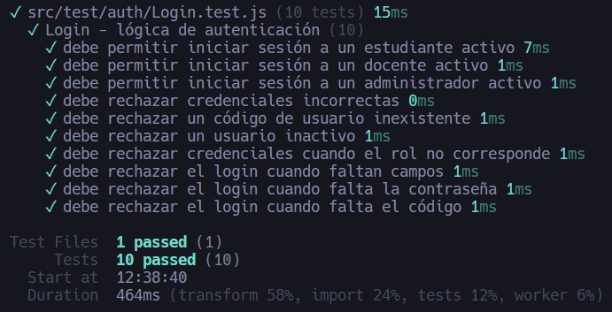

**Ejemplo de prueba unitaria del Front-End**

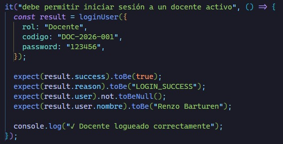

#### Pruebas unitarias del Back-End

En el Back-End se utiliza **Pest** como herramienta de pruebas para comprobar el comportamiento de los métodos, la lógica de negocio y los servicios desarrollados con Laravel.

Estas pruebas permiten verificar las respuestas esperadas, las validaciones y el comportamiento de las funcionalidades ante diferentes condiciones de entrada.

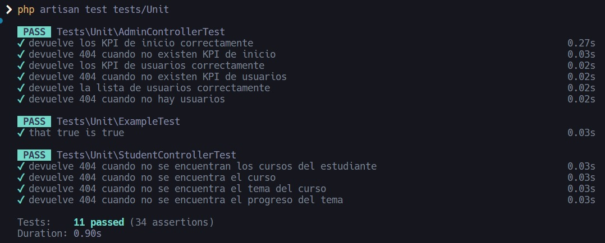

**Ejemplo de prueba con Pest**

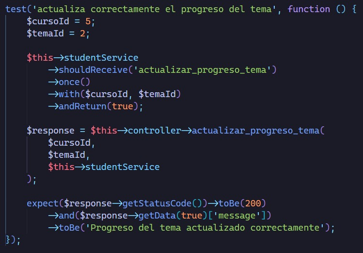

### Pruebas de integración

Las pruebas de integración permiten comprobar que los componentes del sistema se comuniquen correctamente, especialmente durante la conexión entre el Front-End desarrollado con React y el Back-End desarrollado con Laravel.

Se verifica el intercambio de solicitudes y respuestas, el procesamiento de los datos y la comunicación con los servicios necesarios para el funcionamiento de la plataforma.

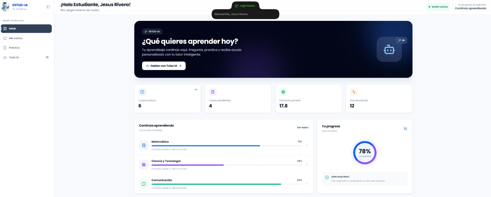

#### Documentación y pruebas de endpoints

Se utiliza **Laravel Scramble** para generar documentación de los endpoints de la API, facilitando la consulta de las rutas disponibles, los parámetros y las respuestas esperadas.

Esta documentación sirve como referencia para revisar y probar los endpoints del Back-End durante el desarrollo y la integración con el Front-End.

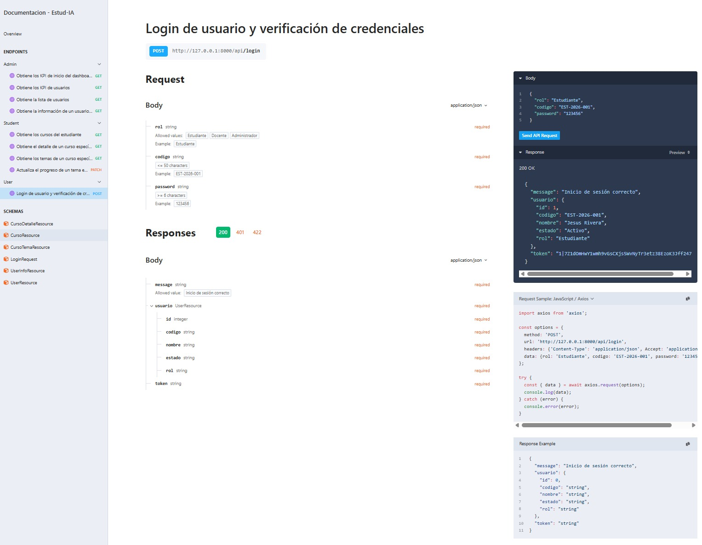

### Pruebas de sistema

Las pruebas de sistema permiten comprobar el funcionamiento conjunto de los componentes de ESTUD-IA, verificando que las funcionalidades principales respondan de acuerdo con los requisitos establecidos.

Estas pruebas consideran los flujos de navegación, la interacción con los servicios del Back-End y el procesamiento de la información de la plataforma.

### Pruebas de extremo a extremo (E2E)

Las pruebas E2E se realizan con **Playwright** para verificar los flujos completos de interacción del usuario en la aplicación React.

Permiten simular acciones como navegar por las interfaces, completar formularios, interactuar con elementos de la aplicación y comprobar los resultados obtenidos.

**Pruebas E2E del Front-End**

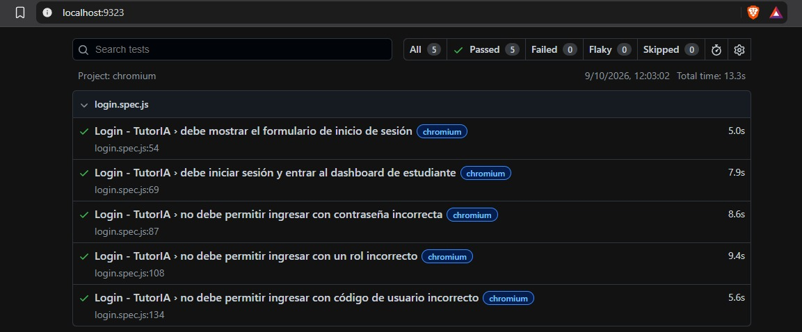

**Ejemplo de prueba E2E**

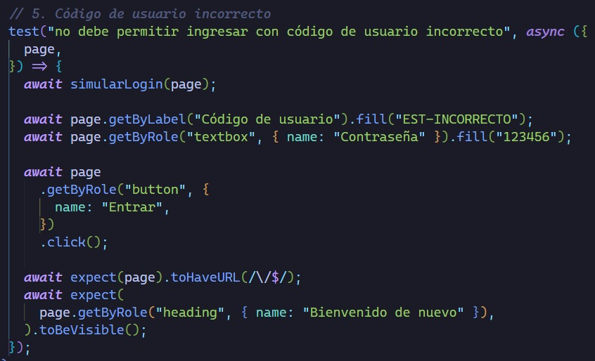

**Ejecución de pruebas en Chromium**

Playwright permite ejecutar las pruebas en Chromium para comprobar el comportamiento de la aplicación en un navegador basado en este motor.

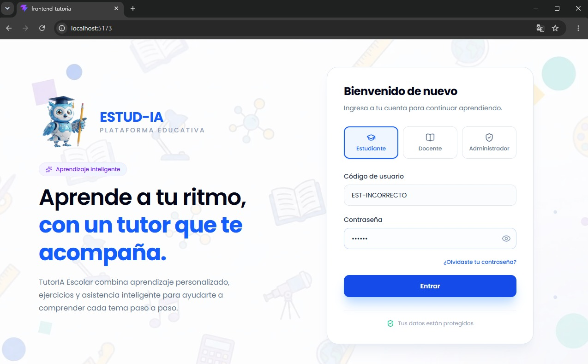

### Pruebas de regresión

Las pruebas de regresión tienen como objetivo verificar que los cambios, correcciones o nuevas funcionalidades no afecten el comportamiento de las funcionalidades existentes.

En ESTUD-IA, estas pruebas consisten en revisar la aplicación de manera integral, recorriendo los principales flujos de los roles Estudiante, Administrador y Docente, según las funcionalidades implementadas.

Se comprueba el acceso a la plataforma, la navegación, las operaciones disponibles, la comunicación entre el Front-End y el Back-End y la presentación correcta de la información.

### Pruebas de aceptación

Las pruebas de aceptación de ESTUD-IA permiten verificar que las funcionalidades desarrolladas cumplan con los criterios de aceptación definidos en las Historias de Usuario y respondan a las necesidades de los roles Estudiante, Administrador y Docente.

Se comprueba que el estudiante pueda iniciar sesión, consultar cursos, revisar contenidos educativos; que el administrador pueda gestionar usuarios y cursos; y que el docente pueda consultar sus cursos asignados y las métricas de sus aulas.

## Pruebas no funcionales

Las pruebas no funcionales permiten evaluar características de calidad de ESTUD-IA que van más allá del comportamiento funcional, como el rendimiento, la seguridad, la facilidad de uso y la compatibilidad con diferentes dispositivos.

### Pruebas de rendimiento

Las pruebas de rendimiento permiten observar el tiempo de respuesta de los endpoints y detectar operaciones que puedan requerir optimización.

Se utiliza **Laravel Telescope** para inspeccionar las solicitudes HTTP, revisar su duración y analizar las consultas y los eventos relacionados con la ejecución de las operaciones del Back-End.

La información obtenida facilita la identificación de endpoints que presentan tiempos de respuesta elevados y ayuda a orientar futuras mejoras de rendimiento.

### Pruebas de seguridad

Las pruebas de seguridad buscan identificar posibles vulnerabilidades y comprobar los mecanismos de protección implementados en ESTUD-IA.

Se consideran aspectos como la autenticación, la autorización, la validación de entradas y el control de acceso a los recursos de la aplicación.

#### Análisis de seguridad con OWASP

El proyecto contempla el análisis de seguridad mediante **OWASP**, con el propósito de identificar posibles vulnerabilidades y evaluar aspectos de seguridad de la aplicación.

El reporte del análisis se encuentra en el siguiente documento:

[**Reporte de Integración ESTUD-IA (PDF)**](Laboratorio/docs/Reporte%20Integracion%20Estud-IA.pdf)

Este documento reúne el análisis realizado sobre la seguridad del proyecto y sirve como referencia para identificar posibles riesgos y definir mejoras.

### Pruebas de usabilidad

Las pruebas de usabilidad permiten evaluar si las interfaces de ESTUD-IA son comprensibles y fáciles de utilizar, considerando las necesidades de los estudiantes, docentes y administradores.

Se consideran aspectos como la claridad de la navegación, la organización de la información, la facilidad para completar tareas y la consistencia visual de las interfaces.

### Pruebas de compatibilidad

Las pruebas de compatibilidad permiten comprobar que ESTUD-IA se visualice y funcione correctamente en diferentes tamaños de pantalla y dispositivos.

Se consideran los siguientes entornos:

- **Computadoras:** revisión de la distribución de los elementos y la navegación en pantallas de escritorio.
- **Tabletas:** comprobación de la adaptación de las interfaces a pantallas de tamaño intermedio.
- **Dispositivos móviles:** verificación de la navegación, los formularios y la visualización del contenido en pantallas pequeñas.

Estas pruebas buscan garantizar una experiencia de uso consistente y una interfaz adaptable a diferentes dispositivos.

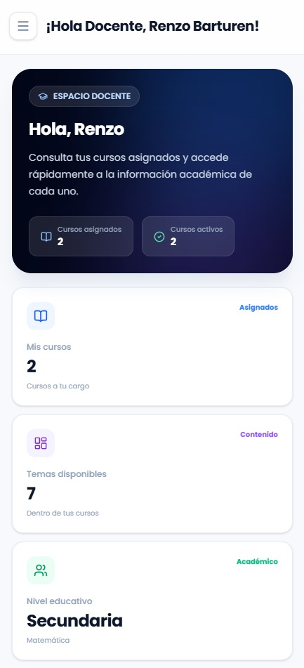

## Casos de prueba

Los casos de prueba describen las condiciones, acciones y resultados esperados que permiten verificar el correcto funcionamiento de las funcionalidades de ESTUD-IA.

A continuación, se presentan algunos ejemplos representativos:

| ID | Funcionalidad | Tipo de prueba | Resultado esperado |
| --- | --- | --- | --- |
| CP-01 | Validación de inicio de sesión | Funcional | El sistema permite el acceso con credenciales válidas y rechaza las inválidas. |
| CP-02 | Consulta de cursos | Integración | El sistema obtiene y muestra los cursos disponibles para el usuario. |
| CP-03 | Validación de datos de entrada | Unitaria | El Back-End rechaza los datos que no cumplen las reglas de validación. |
| CP-04 | Consulta de cursos asignados | Funcional | El docente puede consultar los cursos asociados a su cuenta. |
| CP-05 | Acceso a rutas protegidas | Seguridad | Las solicitudes sin autorización válida no pueden acceder a los recursos protegidos. |
| CP-06 | Flujo de navegación del estudiante | E2E | El usuario puede completar el flujo de navegación definido sin errores. |
| CP-07 | Regresión de funcionalidades | Regresión | Los cambios no alteran el funcionamiento de las funcionalidades previamente implementadas. |
| CP-08 | Tiempo de respuesta de endpoints | Rendimiento | Se registran y analizan los tiempos de respuesta para identificar operaciones lentas. |
| CP-09 | Visualización en dispositivos | Compatibilidad | La interfaz se adapta correctamente a computadoras, tabletas y móviles. |

Los casos anteriores son ejemplos de referencia y deben ajustarse a las funcionalidades implementadas y a los resultados obtenidos durante las pruebas.

## Criterios de aceptación

Una funcionalidad se considera aceptada cuando cumple los criterios definidos para su Historia de Usuario y supera las verificaciones correspondientes.

Como criterios generales:

- La funcionalidad cumple los requisitos establecidos.
- Los resultados obtenidos corresponden con los resultados esperados.
- Las validaciones de entrada funcionan correctamente.
- Los controles de autenticación y autorización protegen las rutas correspondientes.
- La comunicación entre el Front-End y el Back-End funciona según lo previsto.
- Las pruebas unitarias y de integración correspondientes se ejecutan correctamente.
- Los flujos E2E definidos se completan sin errores.
- No se identifican errores críticos que impidan utilizar la funcionalidad.
- La interfaz mantiene un comportamiento adecuado en los dispositivos evaluados.
- Los resultados y los errores detectados durante las pruebas quedan documentados.

---

Proyecto académico desarrollado para el curso **Curso Integrador II: Software** de la Universidad Tecnológica del Perú.
